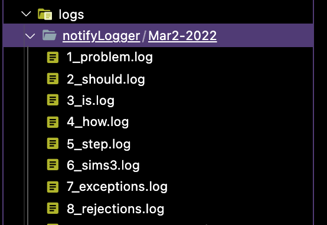
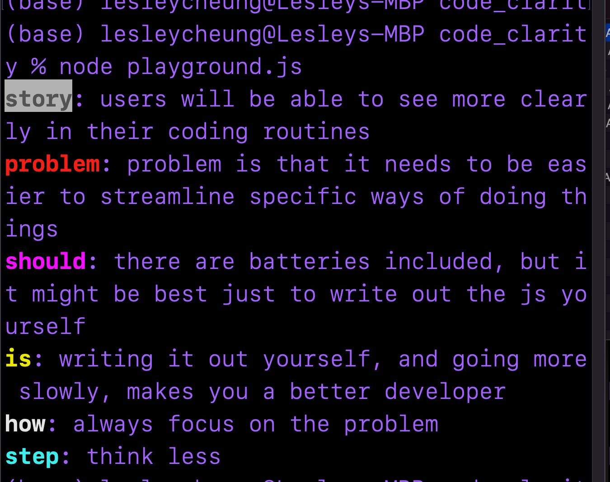

# Logger 




```js

const { winston, see, createLogger } = require("code_clarity")

let notify = createLogger("notifyLogger")
winston.loggers.add("see", see)
winston.loggers.add("notifyLogger", notify)
    // see.problem("hi")
    // see.story("hi")
    // see.problem("problem")
    // see.should("should")
    // see.is("is")
    // see.how("think")
    // see.step("step")
notify.problem("hi")

notify.story("hi")

notify.should("hi")

notify.is("hi")

notify.how("hi")

notify.step("hi")
```